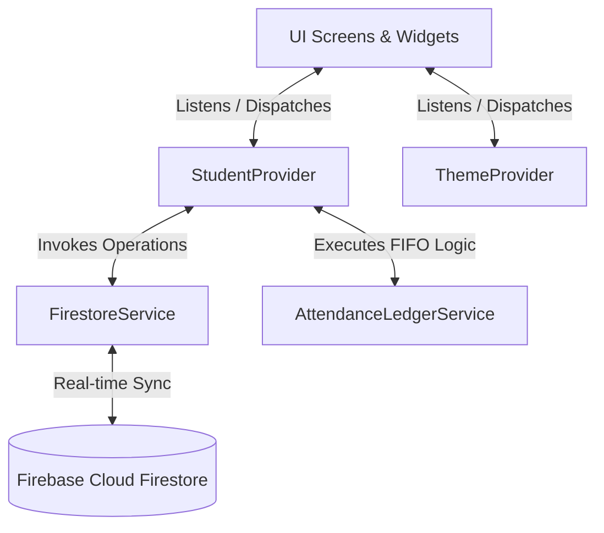

# 🎓 TutionTrack — Smart Tution Management System

[](https://flutter.dev)
[](https://dart.dev)
[](https://firebase.google.com)
[](https://flutter.dev)
[](LICENSE)
[](.github/workflows/build_apk.yml)

**TutionTrack** is a production-ready, cross-platform mobile application meticulously engineered for private tutors, home educators, and small coaching institutes. It simplifies complex attendance tracking, automates missed-class reconciliation through a First-In-First-Out (FIFO) algorithm, manages monthly class quotas, and tracks student payment statuses with real-time cloud synchronization.

---

## 📋 Table of Contents

- [Overview & Problem Statement](#-overview--problem-statement)
- [Key Features](#-key-features)
- [App Architecture & Data Flow](#-app-architecture--data-flow)
- [Project Directory Structure](#-project-directory-structure)
- [Tech Stack & Dependencies](#-tech-stack--dependencies)
- [Getting Started](#-getting-started)
  - [Prerequisites](#prerequisites)
  - [Firebase Configuration](#firebase-configuration)
  - [Installation & Execution](#installation--execution)
- [Testing & Quality Assurance](#-testing--quality-assurance)
- [Building for Production (APK)](#-building-for-production-apk)
- [CI/CD Pipeline](#-cicd-pipeline)
- [License](#-license)

---

## 💡 Overview & Problem Statement

Private tutoring often presents logistical challenges:
1. **Missed & Makeup Class Tracking**: Manually remembering which missed classes have been compensated by makeup sessions becomes error-prone over time.
2. **Quota & Carry-Forward Management**: Tracking whether a student met their target monthly classes (e.g., 8 or 12 sessions/month) and handling carry-forward extra sessions requires careful bookkeeping.
3. **Fee Status Oversight**: Tutors need clarity on which students have paid their monthly fees and when payments were logged.

**TutionTrack** solves these problems with an intuitive, modern interface powered by an automated ledger engine that calculates missed dates, maps makeup classes in FIFO order, and maintains full real-time state synchronization via Firebase Cloud Firestore.

---

## ✨ Key Features

### 🔐 1. Dual Authentication & Security
- **Email & Password**: Complete authentication workflow including email verification, password reset, and session persistence.
- **Google Sign-In**: 1-tap OAuth authentication integrated via Google Play Services.
- **Data Isolation**: User data is strictly isolated per authenticated UID in Cloud Firestore security rules.

### 👨‍🎓 2. Student Management System
- **Comprehensive Profiles**: Store student name, grade/class, subjects, monthly fee rate, target monthly quota, and custom scheduled days (e.g., Mon, Wed, Fri).
- **Active vs. Archived States**: Soft-delete/archive students who discontinue, preserving their complete historical attendance and payment metrics.
- **Custom Color Coding**: Assign distinct visual avatar colors for quick identification across the app.

### ⚡ 3. Smart Attendance & FIFO Reconciliation Engine
- **One-Tap Check-In**: Instantly log today's attendance with automatic timestamping and time-slot classification (*Morning, Afternoon, Evening, Night*).
- **Session Types**:
  - `SCHEDULED`: Regular class conducted on designated days.
  - `MAKEUP`: Compensatory session automatically mapped (FIFO) to the earliest unresolved missed class date.
  - `EXTRA`: Bonus session conducted beyond the monthly target quota.
- **Manual Backdating**: Record historical sessions for past dates with automated gap recalculation.

### 📊 4. Quota & Gap Ledger Tracking
- **Circular Progress Rings**: Real-time visual progress representing completed sessions vs. target monthly quota.
- **Bonus & Carry-Forward Calculations**: Intelligently identifies extra classes completed beyond quota.
- **Gap Ledger Cards**: Visual cards displaying pending unresolved missed dates and their associated makeup sessions.

### 💰 5. Fee & Payment History
- **Monthly Fee Statuses**: Clear indicators for `PAID`, `PENDING`, or `OVERDUE` monthly fees.
- **Payment Logs**: Record partial or full payments with custom transaction dates, notes, and payment methods.
- **Currency Formatting**: Localized Bangladeshi Taka (`৳`) and international currency formatting utilities.

### 🎨 6. Custom Themes & High-Contrast Dark Mode
- **6 Curated Accent Presets**: Custom palette presets (Deep Indigo, Emerald Green, Sunset Amber, Crimson Red, Royal Purple, Cyan).
- **OLED Dark Mode**: Deep slate background surface optimized for AMOLED screens and battery efficiency.

---

## 📐 App Architecture & Data Flow

TutionTrack follows the **MVVM (Model-View-ViewModel)** architectural pattern using Flutter's **Provider** package for state management.



### Core Architecture Principles:
- **Reactive UI Layer**: UI components rebuild reactively when Provider state mutates.
- **Decoupled Business Engine**: `AttendanceLedgerService` contains pure, testable algorithms for missed date detection and session classification without UI/Firestore dependencies.
- **Service Layer Abstraction**: `FirestoreService` encapsulates all direct Cloud Firestore calls, CRUD queries, and JSON mapping.

---

## 📦 Project Directory Structure

```
Tution-Track/
├── tution_track/                       # Main Flutter Mobile Application
│   ├── android/                        # Android Native Source, Gradle, Manifests
│   │   └── app/src/main/
│   │       ├── AndroidManifest.xml     # App Permissions & Launcher Config
│   │       └── kotlin/com/tutiontrack/ # Native Android Entry Point
│   │
│   ├── lib/
│   │   ├── main.dart                   # Flutter App Entry Point & Provider Injection
│   │   ├── authentication/             # Authentication Module
│   │   │   └── screens/                # Login, Register, Forgot/Reset Password, Verify Email
│   │   ├── models/                     # Data Models & JSON Serialization
│   │   │   ├── student_model.dart      # Student Profile Schema
│   │   │   ├── session_model.dart      # Class Session & Type Schema
│   │   │   ├── payment_model.dart      # Fee Payment Record Schema
│   │   │   └── gap_ledger_model.dart  # Missed/Makeup Class Reconciliation Schema
│   │   ├── providers/                  # State Management Providers
│   │   │   ├── student_provider.dart   # Main App State (Students, Sessions, Payments)
│   │   │   └── theme_provider.dart     # Theme Mode & Accent Color State
│   │   ├── screens/                    # Application Pages
│   │   │   ├── home_screen.dart        # Main Dashboard & Student List
│   │   │   ├── student_detail_screen.dart # Attendance Calendar, Sessions & Gap Ledger
│   │   │   ├── student_form_screen.dart   # Add / Edit Student Form
│   │   │   ├── payment_history_screen.dart # Student Payment History & Add Fee Record
│   │   │   ├── settings_screen.dart    # Theme Selection & Account Settings
│   │   │   └── splash_screen.dart      # App Startup & Auth Gateway
│   │   ├── services/                   # Service Layer
│   │   │   ├── firestore_service.dart  # Firebase Cloud Firestore CRUD Engine
│   │   │   └── attendance_ledger_service.dart # FIFO Missed/Makeup Calculation Engine
│   │   ├── utils/                      # Utilities & Themes
│   │   │   ├── theme.dart              # Custom Material 3 Light/Dark Themes
│   │   │   ├── accent_colors.dart      # 6 High-Contrast Preset Palettes
│   │   │   ├── formatters.dart         # Date, Time-slot & Currency Utilities
│   │   │   └── constants.dart          # App Name & Global Configuration
│   │   └── widgets/                    # Modular Reusable UI Components
│   │       ├── student_card.dart       # Student Dashboard Card
│   │       ├── session_tile.dart       # Class Session Item with Type Badge
│   │       ├── gap_ledger_card.dart    # Missed Class Reconciliation Card
│   │       ├── next_tution_banner.dart # Upcoming Class Alert Banner
│   │       └── tution_track_logo.dart  # Vector Brand Logo Component
│   │
│   ├── test/                           # Unit & Widget Test Suite (28 Test Specs)
│   │   ├── attendance_ledger_test.dart # Tests for FIFO Logic & Quotas
│   │   ├── models_and_formatters_test.dart # Tests for Models & Utilities
│   │   ├── theme_test.dart             # Tests for Accent Presets & State
│   │   └── widget_test.dart            # Widget Rendering Tests
│   │
│   ├── release_apk/                    # Pre-Compiled Release Binaries (.apk)
│   └── pubspec.yaml                    # Flutter Package Dependencies & Assets
│
├── .github/
│   └── workflows/
│       └── build_apk.yml               # CI/CD Automated Build Pipeline
└── README.md                           # Repository Documentation
```

---

## 🛠️ Tech Stack & Dependencies

| Category | Technology / Library | Description / Usage |
| :--- | :--- | :--- |
| **Framework** | [Flutter 3.x](https://flutter.dev) | Cross-platform UI toolkit |
| **Language** | [Dart 3.x](https://dart.dev) | Strong null-safety, async processing |
| **State Management** | `provider` (`^6.1.2`) | Reactive ChangeNotifier architecture |
| **Database** | `cloud_firestore` (`^5.6.6`) | Real-time NoSQL Cloud Database |
| **Authentication** | `firebase_auth` (`^5.6.0`) | Email/Password & Token management |
| **Google Sign-In** | `google_sign_in` (`^6.2.1`) | Native Google OAuth authentication |
| **Calendar** | `table_calendar` (`^3.1.2`) | Interactive monthly calendar view |
| **Screen Adapter** | `flutter_screenutil` (`^5.9.3`) | Responsive scaling for all mobile screen sizes |
| **Typography** | `google_fonts` (`^6.2.1`) | Modern Outfit typography |
| **Formatting** | `intl` (`^0.19.0`) | Date formatting & number parsing |

---

## 🚀 Getting Started

### Prerequisites

Ensure your local development environment meets the following requirements:
- **Flutter SDK**: `>= 3.0.0`
- **Dart SDK**: `>= 3.0.0`
- **Android Studio** (with Android SDK 34+) or **VS Code** with Flutter & Dart extensions
- **Git** installed on your system

---

### 🔥 Firebase Configuration

1. Go to the [Firebase Console](https://console.firebase.google.com/) and create a new project named **TutionTrack**.
2. Register an **Android App** with the package name: `com.tutiontrack.app`
3. Download `google-services.json` and place it in the directory:
   ```
   Tution-Track/tution_track/android/app/google-services.json
   ```
4. Enable **Authentication** methods in Firebase Console:
   - Email/Password
   - Google Sign-In
5. Enable **Cloud Firestore Database** and apply security rules scoping data to `request.auth.uid`.

---

### 📥 Installation & Execution

1. **Clone the Repository**
   ```bash
   git clone https://github.com/YOUR_USERNAME/Tution-Track.git
   cd Tution-Track/tution_track
   ```

2. **Install Flutter Dependencies**
   ```bash
   flutter pub get
   ```

3. **Verify Environment Setup**
   ```bash
   flutter doctor
   ```

4. **Run Application** (Connect your mobile device or start an emulator):
   ```bash
   flutter run
   ```

---

## 🧪 Testing & Quality Assurance

The repository includes comprehensive unit and widget tests for core business logic, FIFO reconciliation, serialization, and UI rendering.

### Running Tests
Execute the automated test suite with:
```bash
cd tution_track
flutter test
```

### Static Analysis
Run Flutter static code analyzer to verify code quality:
```bash
flutter analyze
```

---

## 📦 Building for Production (APK)

To build optimized release APK binaries split per CPU architecture (reducing bundle size for end users):

```bash
cd tution_track
flutter build apk --split-per-abi
```

Generated APKs will be located at:
- `build/app/outputs/flutter-apk/app-arm64-v8a-release.apk` (For 64-bit Android devices)
- `build/app/outputs/flutter-apk/app-armeabi-v7a-release.apk` (For 32-bit Android devices)
- `build/app/outputs/flutter-apk/app-x86_64-release.apk` (For emulators & Intel devices)

---

## ⚙️ CI/CD Pipeline

This project includes a **GitHub Actions CI workflow** located in [`.github/workflows/build_apk.yml`](.github/workflows/build_apk.yml).

The workflow automatically:
1. Triggers on pushes and pull requests to `main` / `master`.
2. Sets up Java 17 and Flutter SDK environment.
3. Installs dependencies and runs `flutter analyze` & `flutter test`.
4. Compiles release APK binaries and attaches them as workflow artifacts.

---

## 📄 License

Distributed under the **MIT License**. See [`LICENSE`](LICENSE) for more information.

---

<p align="center">
  Crafted with ❤️ for Tutors and Educators.
</p>
